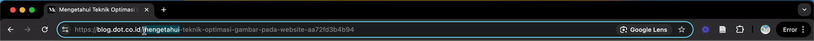
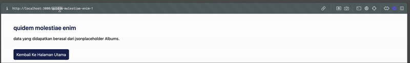

<h1 align="center" style="font-size: 30px;margin:0;"><b>Self Healing URL <br /> To maximize SEO on Next JS</br></h1>


<p align="center" style="font-size: 15px;margin:20px 0;">This project was inspired by Medium's blog detail page. In the path section, it contains the title and ID at the end. If you delete the title and leave the ID. Then the URL will return to its original state. For example as below:
</p>



<p align="center">for details, you can see my article here: <br> <a href="https://medium.com/dot-intern/self-healing-url-untuk-memaksimalkan-seo-pada-next-js-3116d1ec0917">https://medium.com/dot-intern/self-healing-url-untuk-memaksimalkan-seo-pada-next-js-3116d1ec0917</a></p>

<p align="center" style="font-size: 15px;margin:20px 0;">You want to speak English? Translate it yourself xoxo.</p>

## How to run ?

```bash
pnpm install

# then

pnpm dev
```

## The final result was as follows


Preview: <a href="self-healing-url-nextjs-demo.vercel.app"> self-healing-url-nextjs-demo.vercel.app</a>